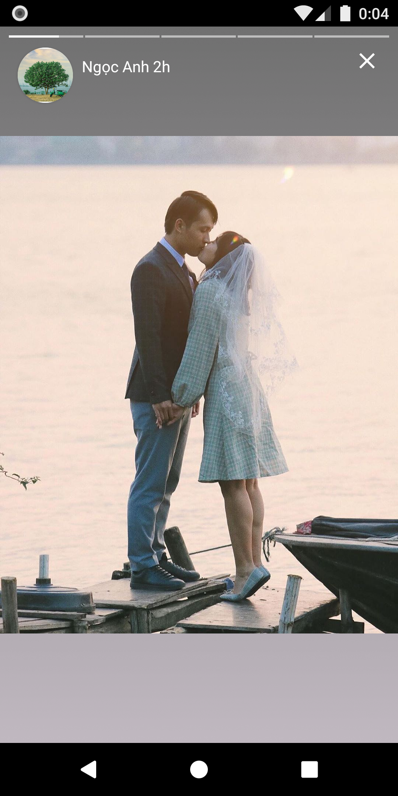

# Ứng dụng chat MyMessage
Mymessage sử dụng ngôn ngữ java và hệ quản trị cơ sở dữ liệu Firebase để lưu trữ dữ liệu
## Tính năng của ứng dụng:
* Đăng ký tài khoản bằng tài khoản google hoặc gmail.
* Quên mật khẩu lấy lại bằng mail
* Chat 1-1, Chat 1-n (Có gửi ảnh, thả cảm xúc tin nhắn, xóa tin nhắn, thu hồi tin nhắn,...)
* Đăng Story
Các hình ảnh mô tả về ứng dụng

